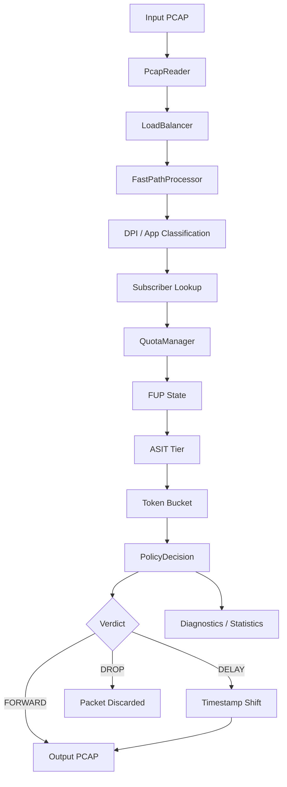
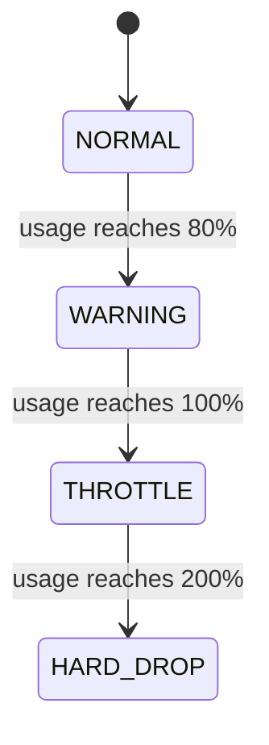

# FlowGate
**Subscriber-Aware Traffic Policy & Diagnostics Engine**


## Overview

FlowGate is a Java-based PCAP traffic-policy simulation and prototype. 
It processes offline packet captures to identify network applications and subscribers, tracks their quota usage against a Fair Usage Policy (FUP), applies application-aware throttling, and produces explainable policy decisions and diagnostics.

FlowGate is designed to be an understandable prototype for developers who know Java, focusing on observable policy enforcement.

---

## Problem Statement

When a subscriber exceeds a configured data quota, an application-aware policy can apply different limits to different types of traffic instead of treating every application equally. This is intended to protect designated essential traffic while applying stronger limits to non-essential traffic. 

FlowGate simulates an application-aware approach:
```text
Subscriber exceeds FUP quota
        ↓
Do not treat every application equally
        ↓
Essential traffic (e.g., WhatsApp, Google Pay) remains protected
Standard traffic (e.g., Google, Gmail) is throttled moderately
Entertainment traffic (e.g., Netflix, Spotify) is throttled more aggressively
```

*Note: FlowGate is an **application-aware FUP simulation using offline PCAP files**. It is not a production ISP enforcement system designed for live router integration.*

---

## Key Features

*   **Multi-threaded packet processing**
*   **Five-tuple-based flow affinity**
*   **Layer-7 application identification** (via DNS, HTTP Host, and TLS SNI where supported)
*   **Subscriber-aware quota tracking** (with support for Off-Peak hours)
*   **FUP state machine** (Normal, Warning, Throttle, Hard-Drop)
*   **ASIT application tiers** (Essential, Standard, Entertainment)
*   **CAS-based Token Bucket / atomic state updates** for rate limiting
*   **`FORWARD` / `DELAY` / `DROP`** policy enforcement
*   **PCAP timestamp-based delay simulation**
*   **Explainable `PolicyDecision` + `ReasonCode`** for packets evaluated by FlowGate
*   **Evidence-based diagnostics** to explain policy effects
*   **CSV/JSON analytics/reporting**
*   **Deterministic PCAP fixtures** for testing and demonstration

---

## Architecture



Packets are read from an offline PCAP file and load-balanced to worker threads (`FastPathProcessor`) using a 5-tuple hash to provide flow affinity. Workers classify applications in parallel (SNI, HTTP Host, or DNS where applicable). Shared subscriber FUP/quota evaluation is then applied in PCAP `packetId` order so cumulative usage and policy states stay deterministic. The `QuotaManager` resolves FUP state and ASIT tier, applies the Token Bucket when throttling, and produces a `PolicyDecision` (`FORWARD` / `DELAY` / `DROP`).

---

## End-to-End Packet Flow

For packets evaluated, FlowGate follows this flow:

1. Read packet from PCAP.
2. Distribute it to a processing worker (`FastPathProcessor`) based on a 5-tuple hash.
3. Parse and classify the packet (tracking TCP state and extracting SNI/DNS/Host metadata). Classification may run concurrently across workers.
4. Identify the subscriber's IP and resolve their active plan.
5. Evaluate shared quota/FUP in PCAP packet order (usage accumulates in capture sequence unless off-peak; DPI workers may still run in parallel).
6. Determine the current FUP state (`NORMAL`, `WARNING`, `THROTTLE`, `HARD_DROP`).
7. Determine the application's ASIT tier (`ESSENTIAL`, `STANDARD`, `ENTERTAINMENT`).
8. Apply Token Bucket rate limiting if the subscriber is throttled (non-essential traffic).
9. Produce a structured `PolicyDecision`.
10. Execute the verdict: `FORWARD` (pass normally), `DELAY` (shift the output PCAP timestamp; no thread sleep), or `DROP` (exclude from output).
11. Update system statistics and retain the decision for the diagnostic engine.
12. Write the output packet to the new PCAP (if not dropped).

---

## FUP State Machine



*   **NORMAL**: Usage is under 80% of the configured quota. All traffic flows at full speed.
*   **WARNING**: Usage is between 80% and 100%. A warning is issued, but traffic remains at full speed.
*   **THROTTLE**: Usage reaches 100%. ASIT (App-Selective Intelligent Throttling) is activated.
*   **HARD_DROP**: Usage reaches or exceeds the configured hard-drop threshold.

---

## ASIT (App-Selective Intelligent Throttling)

During the `THROTTLE` state, FlowGate applies distinct bandwidth limits based on the application's tier.

| Tier | Example Traffic | Behavior During FUP |
| :--- | :--- | :--- |
| **ESSENTIAL** | WhatsApp, Google Pay | Protected from ASIT throttling |
| **STANDARD** | Google, Gmail | Moderate throttling (e.g., 256 Kbps) |
| **ENTERTAINMENT** | Netflix, Spotify | Stronger throttling (e.g., 64 Kbps) |

These tiers are intended to keep designated essential traffic protected from ASIT throttling while stronger limits are applied to non-essential traffic.

---

## Token Bucket

FlowGate implements throttling using a CAS-based Token Bucket with atomic state updates. 

*   Tokens represent the available transmission budget (in bytes).
*   Tokens are replenished according to elapsed PCAP time and the configured bandwidth rate.
*   Each packet consumes tokens equal to its size.
*   If insufficient tokens exist, the packet receives a `DELAY` verdict (simulated by advancing the output PCAP timestamp, not by sleeping the worker thread).
*   The bucket's capacity allows for short bursts of traffic.

**FlowGate uses PCAP timestamps for time simulation**, not wall-clock time, so rate math does not depend on how fast the machine processes the file.

*Note: In the deterministic demo configuration, bandwidth limits are configured to artificially tiny values (e.g., 1 Kbps, 2 Kbps). This ensures that the small test PCAP instantly depletes the Token Bucket to demonstrate throttling behavior.*

---

## Policy Decisions

Packets evaluated by the policy engine result in a comprehensive `PolicyDecision` record containing:
*   Subscriber IP, Plan, and FUP State
*   AppType and ASIT Tier
*   Current usage statistics
*   The final **Verdict**:
    *   `FORWARD`: Packet is written to output.
    *   `DELAY`: Packet is written to output with a simulated delay added to its PCAP timestamp.
    *   `DROP`: Packet is discarded.
*   A **ReasonCode**: A machine-readable explanation (e.g., `FUP_QUOTA_EXCEEDED`, `HARD_DROP_THRESHOLD`, `ESSENTIAL_TRAFFIC_PROTECTED`).

By generating a structured decision record, the system can transparently explain not only *what* it did, but *why* it did it.

---

## Diagnostics

The `ConnectionHealthAnalyzer` acts as an evidence-based diagnostic engine. By looking at a list of recent `PolicyDecision` records for a given subscriber, it can explain the effects of FlowGate policies on the subscriber's connection.

Supported diagnoses:
*   `HARD_DROP`: The subscriber's traffic is being dropped due to exceeding the hard-drop threshold.
*   `FUP_ENTERTAINMENT` / `FUP_STANDARD`: The subscriber is experiencing slow speeds because their quota is exhausted and the application is being actively throttled based on its tier.
*   `ESSENTIAL_PROTECTED`: The subscriber is throttled, but this specific essential application is being forwarded successfully.
*   `FUP_WARNING`: The subscriber is approaching their quota limit but is not yet throttled.
*   `IDLE`: No recent traffic data for the subscriber.
*   `HEALTHY`: No FlowGate throttling or hard-drop detected in the analyzed data.

*Note: A `NETWORK_CONGESTION` cause was considered but is currently deferred. True physical network congestion requires queue-depth telemetry or packet-loss counters sourced from hardware, which this offline simulation does not possess.*

---

## Repository Structure

```text
FlowGate/
├── config/              # Runtime configuration and policy files
│   └── demo/            # Configurations for the deterministic demo
├── samples/             # Sample PCAP files for testing
├── src/                 # Java source and test code
├── tools/               # Infrastructure scripts (generate_pcaps.py)
├── run_demo.sh          # Executable end-to-end demo script
├── pom.xml              # Maven configuration
├── README.md
├── LICENSE
└── reports/             # Generated analytics (gitignored; created at runtime)
```

---

## Build Requirements

*   **Java 21**
*   **Maven 3.x**

To compile and package the project:
```bash
mvn clean package
```
This produces an executable JAR at `target/flowgate-1.0.0.jar`.

---

## Running FlowGate

### Basic Execution (Pure DPI)
```bash
java -jar target/flowgate-1.0.0.jar input.pcap output.pcap
```

### Subscriber-Aware Execution
To enable the FlowGate FUP engine and ASIT policies, provide the configuration files:
```bash
java -jar target/flowgate-1.0.0.jar input.pcap output.pcap \
    --subscribers config/subscribers.txt \
    --throttle-policy config/throttle-policy.txt
```

### Demo
The easiest way to see FlowGate in action is via the provided shell script:
```bash
./run_demo.sh
```
This script compiles the project and processes the committed `samples/flowgate-demo.pcap` using demo-specific configurations to demonstrate the main FUP states and policy outcomes.

---

## Demo Scenario

The `samples/flowgate-demo.pcap` contains **7 × 600-byte** HTTP packets for subscriber `192.168.1.100` under an artificially tiny **2000-byte** Demo quota (WARNING ≈ 80%, THROTTLE = 100%, HARD_DROP = 200%). Demo ASIT limits are **2 Kbps** (STANDARD) and **1 Kbps** (ENTERTAINMENT).

| # | Host | Application | Tier |
|---|------|-------------|------|
| 1 | `whatsapp.com` | WhatsApp | ESSENTIAL |
| 2 | `www.google.com` | Google | STANDARD |
| 3 | `www.netflix.com` | Netflix | ENTERTAINMENT |
| 4 | `mail.google.com` | Gmail | STANDARD |
| 5 | `www.spotify.com` | Spotify | ENTERTAINMENT |
| 6 | `pay.google.com` | Google Pay | ESSENTIAL |
| 7 | `www.google.com` | Google (same 5-tuple as #2) | STANDARD |

Running `./run_demo.sh` shows runtime-derived evidence for:

*   Layer-7 identification of all six applications via **HTTP Host**
*   Cumulative quota usage progressing through **NORMAL → WARNING → THROTTLE → HARD_DROP** (600 → 4200 bytes)
*   Policy results that partition the 7 packets: **FORWARD 4 + DELAY 2 + DROP 1**
*   Same 5-tuple → same FastPath worker (packets 2 and 7)
*   Google Pay evaluated in `THROTTLE` with `FORWARD` / `ESSENTIAL_TRAFFIC_PROTECTED`
*   A subscriber diagnostic ending in `HARD_DROP`

DPI stays multi-worker with 5-tuple affinity; shared FUP evaluation is ordered by `packetId`. The report prints all seven runtime decisions.

---

## Test Strategy

FlowGate includes **53** automated JUnit tests in `src/test/java/`, focusing on core logic correctness:
*   `TokenBucketTest`: Verifies Token Bucket rate-limiting behavior, including PCAP-time refill and concurrent consumption.
*   `QuotaManagerTest`: Ensures FUP state transitions and tier routing function correctly.
*   `SubscriberRegistryTest`: Validates file parsing and plan assignment.
*   `ThrottlePolicyTest`: Validates ASIT configurations.
*   `ConnectionHealthAnalyzerTest`: Tests the diagnostic engine's priority logic.
*   `AppTypeTest`: Guards Google Pay / Gmail classification against generic Google shadowing.
*   `DemoAppTierMappingTest`: Verifies all six demo applications map to the expected ASIT tiers.

**PCAP Fixtures:**
*   `samples/test_dpi.pcap`: A small regression fixture.
*   `samples/baseline.pcap`: A larger (5000 packet) integration/load-like testing fixture.
*   `samples/flowgate-demo.pcap`: The deterministic sequence used for the demo.
*(Note: `tools/generate_pcaps.py` is test-data generation infrastructure, not part of the production application).*

---

## Design Decisions

*   **Five-Tuple Hashing:** Load balancers distribute packets based on Source IP, Dest IP, Source Port, Dest Port, and Protocol so packets in the same flow stay on the same FastPath worker.
*   **Parallel DPI, Ordered FUP:** Classification can run on multiple workers; shared subscriber quota/FUP updates run in PCAP packet order for deterministic policy outcomes.
*   **Application Tiers (ASIT):** Distinct limits keep designated essential traffic protected from ASIT throttling during FUP enforcement.
*   **Token Bucket:** Models bandwidth limits with short bursts using CAS/`AtomicLong` state updates driven by PCAP time (not a formal lock-free claim).
*   **Structured Decisions:** A `PolicyDecision` record supports analytics, debugging, and diagnostics beyond a silent drop.
*   **PCAP Timestamps:** Token Bucket refill and DELAY simulation use the packet timestamp rather than `System.currentTimeMillis()`.
*   **Offline PCAP Processing:** Allows local development and demos without a live network interface.

---

## Limitations / Scope

FlowGate is explicitly designed as a prototype and simulation. 

*   **Offline Processing:** It reads from static PCAP files rather than capturing live packets from a network interface (e.g., via AF_PACKET or DPDK).
*   **Not an ISP Gateway:** It is not designed to be deployed on real ISP edge routers. 
*   **No TLS Decryption:** Application classification depends on metadata available in the captured traffic. When required metadata is unavailable, classification may fall back to a generic or unknown application type.
*   **Artificial Demo Limits:** The quotas and bandwidth limits in the demo configuration are intentionally microscopic to force throttling observable within a few packets.
*   **Ordered FUP Accounting:** FastPath DPI stays concurrent, but `QuotaManager` applies usage/FUP updates in PCAP packet order so state transitions and essential protection are deterministic.
*   **No Genuine Congestion Telemetry:** FlowGate does not measure physical network packet loss or queue depths.

---

## What FlowGate Is / Is Not

| FlowGate is | FlowGate is not |
| :--- | :--- |
| A PCAP-based traffic-policy simulation | A production ISP gateway or router |
| A subscriber-aware policy engine | A real bandwidth enforcer on network interfaces |
| A system with explainable diagnostics | A physical network performance monitor |

---

## Future Improvements

Features **not implemented**, but logically next for an expanded scope:
*   Live interface integration (via libpcap/jNetPcap).
*   Integration of real network queue telemetry for genuine congestion detection.
*   Richer protocol classification (e.g., BitTorrent, RTP).

---

## License

[MIT License](LICENSE)
